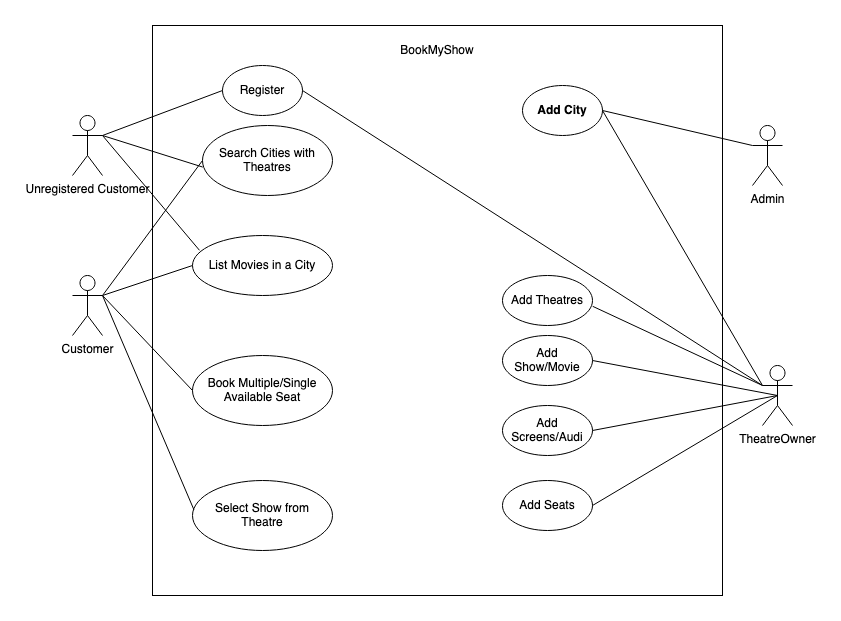
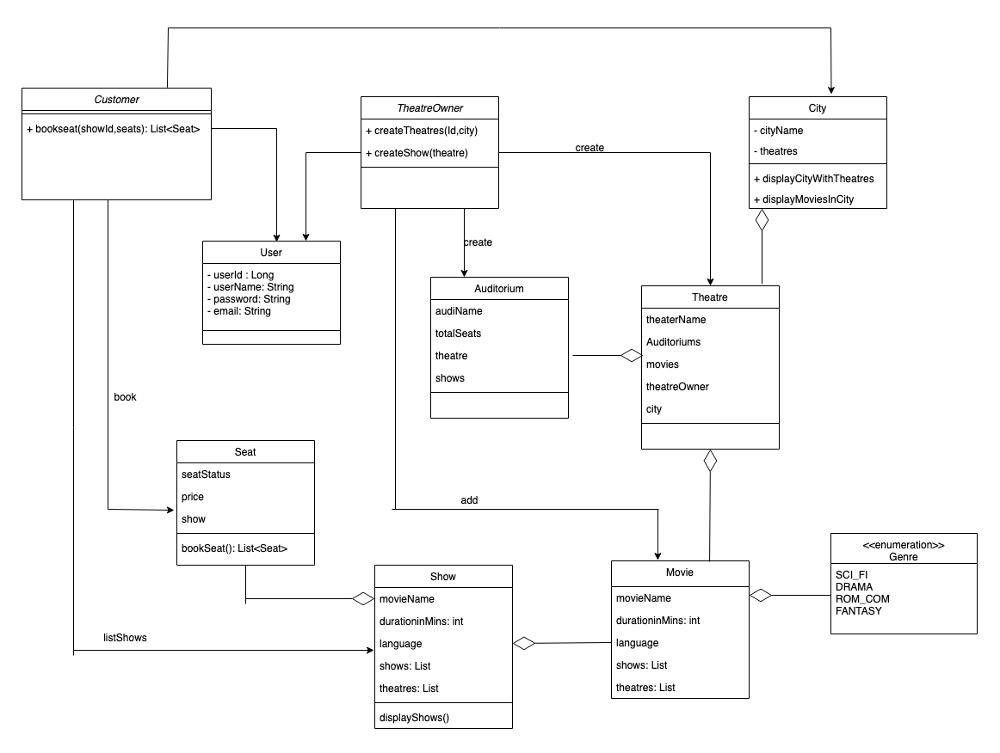
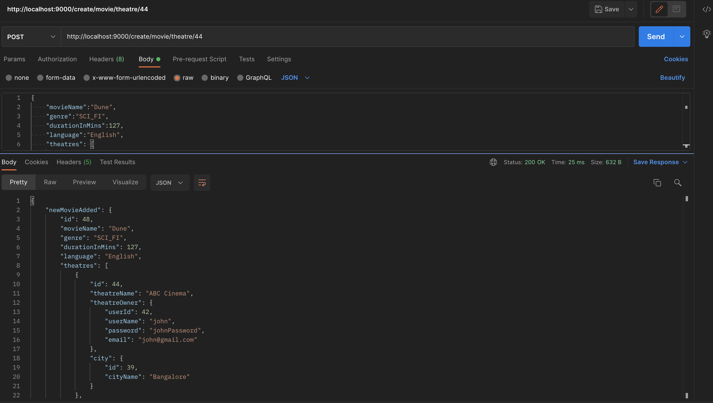
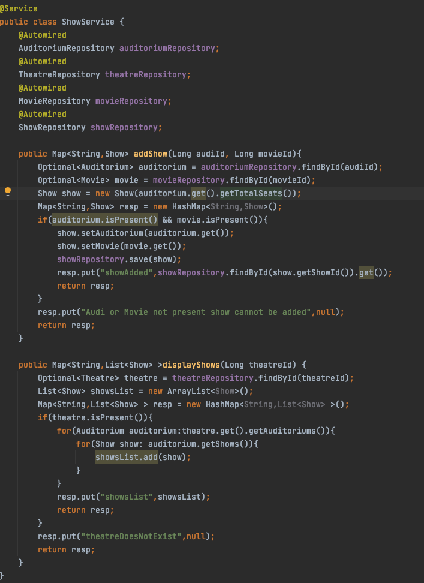

# Low Level Design - Book My Show 

## Introduction
This repository contains the low level design (LLD) implementation of an online movie ticket booking system like BookMyShow

It has features to add movies, create theatres , search for cities with movies, book tickets for shows etc. As per the mentioned requirements, The actual implementation of methods, service APIs is optional

---

## Requirements & Setup

Requirements to run this program are :

- [JDK 1.8](https://www.oracle.com/java/technologies/downloads/#java8)
- [Maven 3](https://maven.apache.org)
- [Postgresql](https://www.postgresql.org/download/)

### Running the application locally
- Clone this repository
- In `resources/application.properties` replace the database credential 
- spring.datasource.url = POSTGRES_URL
    - e.g. jdbc:postgresql://localhost:5432/postgres
- spring.datasource.username=DB_USERNAME
- spring.datasource.password=DB_PASSWORD


To BUILD the application go to the root directory BookMyShowLLD and then execute the following command to build the project:
```
mvn clean install
```

To run the application, execute the following command in the root directory or Run the Application `BookMyShowLldApplication.java`
```shell
mvn spring-boot:run
```
---

## Assumptions
- Admin is adding new cities 
- Theatre Owners can create new theatre, add screen/audi, add seats to audi in the city present else new city will automatically be added
- Non Registered users can look for theatre list, shows list presnt in the city or they can list cities with theatres present
- Registered Users can book seat along with searching for shows, looking city list and all
- Not considering payment module
- Seats with status Available will get booked
- Every Theatre will have some audi's/screen and each screen has limited capacity as mentioned by theatre owner

---

## Use Case Diagram


---

## Class Diagram


---
## API Endpoints - Sample
Audi Addition:
```

Request: 

curl --location --request POST 'http://localhost:9000//auditorium/create/theatre/44' \
--header 'Content-Type: application/json' \
--data-raw '{
    "audiName":"audi_five",
    "totalSeats":200
}'

Response:

{
    "audiAdded": {
        "id": 57,
        "audiName": "audi_five",
        "totalSeats": 200,
        "theatreName": "ABC Cinema",
        "theatreIdx": 44
    }
}

```

Display Shows
```
Request:

curl --location --request GET 'http://localhost:9000/show/display/theatre/44'

Response:

{
    "showsList": [
        {
            "showId": 54,
            "movie": {
                "id": 47,
                "movieName": "Dune",
                "genre": "SCI_FI",
                "durationInMins": 127,
                "language": "English",
                "theatres": [
                    {
                        "id": 43,
                        "theatreName": "Cinepolis",
                        "theatreOwner": {
                            "userId": 42,
                            "userName": "john",
                            "password": "johnPassword",
                            "email": "john@gmail.com"
                        },
                        "city": {
                            "id": 40,
                            "cityName": "Bangalore"
                        }
                    }
                    }
                ]
            "auditorium": {
                "id": 49,
                "audiName": "audi_one",
                "totalSeats": 100,
                "theatreName": null,
                "theatreIdx": null
            },
            "startTime": null,
            "endTime": null
        }
    ]
}

Few response params are intentionally shown for better idea of API they should be hidden while implementation
```
---



## Code Sample


---

Please Feel free to contact me for any queries : goyaldhara555@gmail.com
